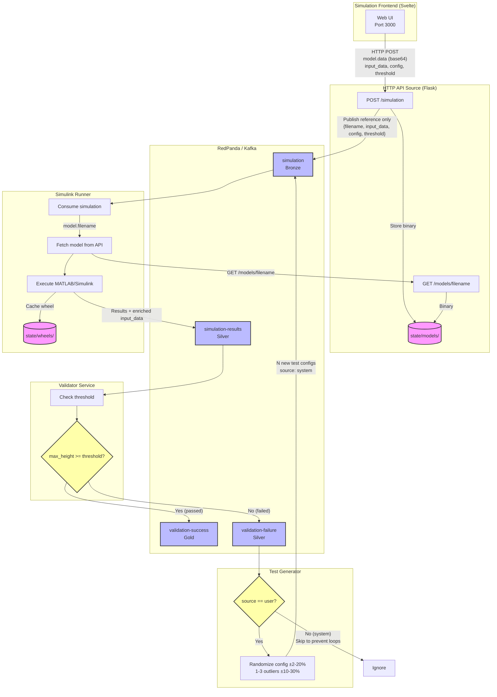
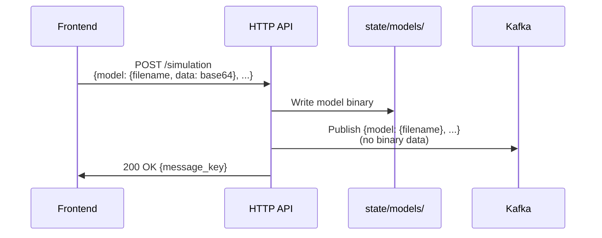
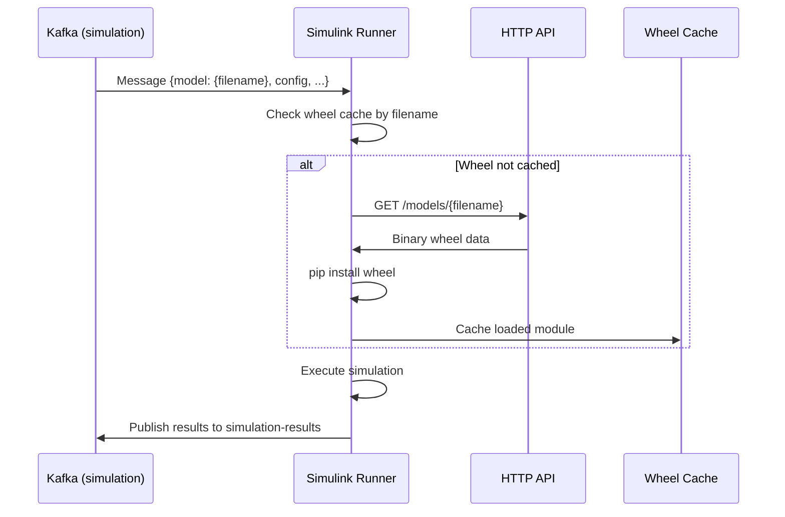
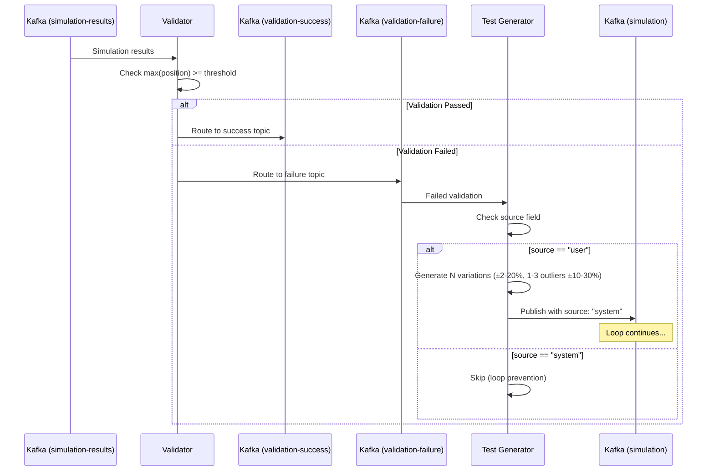

# Simulink Feedback Loop Architecture

## System Overview

## Data Flow Details

### 1. Model Upload Flow

### 2. Simulation Execution Flow

### 3. Validation & Feedback Loop

## Kafka Topics

| Topic | Tier | Purpose |
|-------|------|---------|
| `simulation` | Bronze | Simulation requests (model reference + config) |
| `simulation-results` | Silver | Completed simulations with output data |
| `validation-success` | Gold | Simulations that passed threshold |
| `validation-failure` | Silver | Simulations that failed threshold |

## Key Design Decisions

### Model Storage (Not in Kafka)
- **Problem**: Large model binaries (300MB+) would bloat Kafka messages
- **Solution**: Store models on disk, pass only filename reference in messages
- **Retrieval**: Services fetch models via `GET /models/{filename}` API

### Feedback Loop Prevention
- **Problem**: Generated tests could trigger infinite test generation
- **Solution**: `source` field distinguishes user vs system-initiated requests
- **Rule**: Test Generator only processes `source: "user"` messages

### Model Retention
- Models are stored for 24 hours then automatically cleaned up
- Cleanup runs on HTTP API startup
- Same filename overwrites existing model (no versioning)

## Environment Variables

### HTTP API
| Variable | Description |
|----------|-------------|
| `output` | Kafka topic for simulation requests |
| `HTTP_AUTH_TOKEN` | Bearer token for authentication |

### Simulink Runner
| Variable | Description |
|----------|-------------|
| `input` | Input Kafka topic |
| `output` | Output Kafka topic |
| `API_URL` | URL to fetch models from HTTP API |
| `HTTP_AUTH_TOKEN` | Bearer token for API authentication |

### Test Generator
| Variable | Description |
|----------|-------------|
| `input` | Failed validations topic |
| `output` | Simulation requests topic |
| `NUM_TESTS` | Number of test variations per failure |
